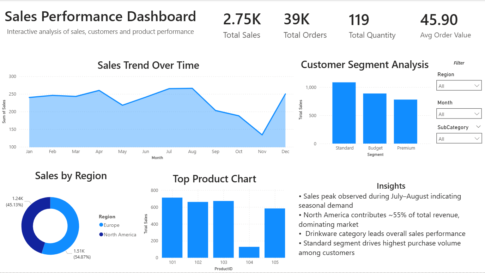

# 📊 Sales Analytics Dashboard (Power BI)

## 🔍 Overview

Developed an interactive Power BI dashboard to analyze sales performance, customer segmentation, and product insights using multi-source data.

## ⚙️ Tools Used

* Power BI
* Power Query
* DAX

## 📈 Key Features

* Built a star schema data model for efficient analysis
* Created KPIs: Total Sales, Total Orders, Total Quantity, Avg Order Value
* Designed interactive dashboard with slicers (Month, Region, Category)
* Visualized sales trends, regional performance, and product insights

## 💡 Key Insights

* Sales peak observed during July–August indicating seasonal demand
* North America contributes ~55% of total revenue
* Drinkware category leads overall sales performance
* Standard customer segment drives highest purchase volume

## 📁 Project File

* `dashboard.pbix` – Power BI dashboard file
* `dashboard.png` – Dashboard preview image
